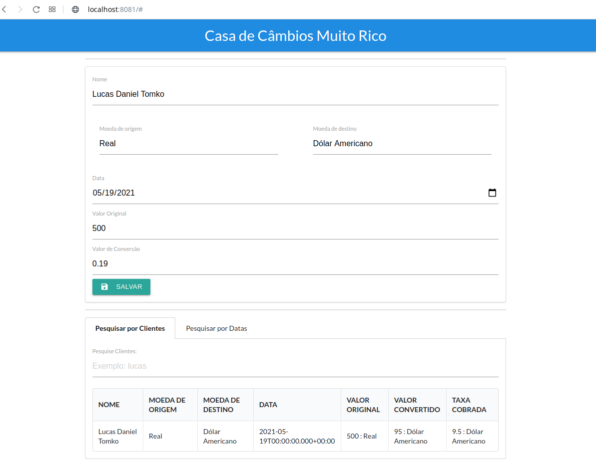
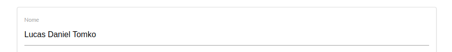
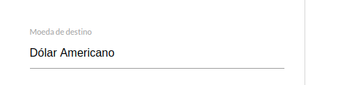
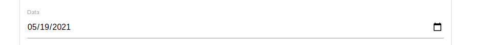
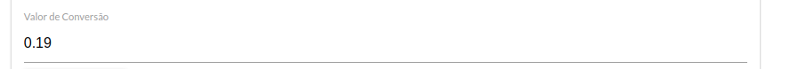
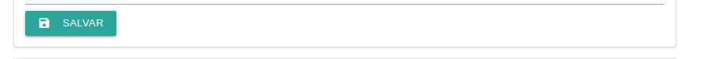
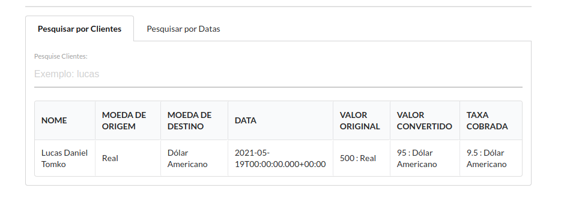

<h1 align="center">
    Projeto Muito Rico - HavanLabs
</h1>
 


<p align="center">
  <a href="https://www.linkedin.com/in/lucas-daniel-pohl-tomko-bb50b71a3/">
    
  </a>


</p>


## :computer: Sobre o projeto

Esta é uma breve explicação e instrução de uso do projeto de desenvolvimento de um sistema para a  Jornada Labs HAVAN.
O projeto consiste na produção de um sistema para uma casa de câmbios fictícia chamada "Muito Rico".

Neste documento será descrito o projeto, tal como o processo de instalação e uso.

Para a realização do projeto foram utilizadas duas linguagens de programação: Java para o back end e JavaScript para o front end. O sistema gerenciador de banco de dados relacional MySQL foi utilizado para cuidar da persistência dos dados em conjunto com a criação de uma ferramenta API com a framework de Java Spring Boot.
    
Para o front end, foi feito o uso da framework de JavaScript VueJs.


## :robot: Sobre a API

Como abordado anteriormente, foi desenvolvida uma API para alimentar o serviço do cliente, note então que o projeto tem dois serviços rodando, a API com Spring e o Cliente com o Vue.

A API vai se comunicar com o banco e devolver os dados no formato JSON para que possa ser consumida pelo front end.
   
É possível também enviar requisições POST que vão traduzir objetos JSON e fazer o devido INSERT no banco (na tabela "cambio", especificamente).

Além disso, a API tem diferentes endpoints que nao foram utilizados devido a facilidade do Vue de processar os dados para fazer pesquisas, esses endpoints fazem gets e devolvem requisições especificas.

  - <b>"/api/v1/cambios/cliente/{nome do cliente}"</b> - retorna apenas os câmbios cujo cliente possui o nome indicado.

  - <b>"/api/v1/cambios/{ID}/"</b> - retorna apenas câmbios cujo id foi indicado na URL.

  - <b>"/api/v1/cambios/data/{data do cambio}"</b> - retorna apenas câmbios cuja data foi indicada na URL

As funcionalidades da API ficaram apenas para o resgate de informação no endpoint "/api/v1/cambios/" e a inserção de informação no mesmo. Por conta do escopo do projeto e do poder da ferramenta VueJs, nem todos os endpoints da API são utilizados.


## :earth_americas: Sobre a Aplicação WEB

O cliente é o que vai ser visto pelo usuário do sistema, a ferramenta foi desenvolvida com Vue Cli v3.

Essa aplicação foi desenvolvida em apenas uma pagina, carregada no HTML através de um \#App Vue.
Por conta disso, não foi necessário o uso de Rotas.

A aplicação consiste de um formulário contendo as informações pedidas pelo desafio, tabela para a exibição dos câmbios feitos e dois tipos de pesquisa, por cliente e por data.

<p align="center" style="display: flex; align-items: flex-start; justify-content: center;">
  
</p>
    
Note que no formulário tem duas informações pedidas que não estão no formulário, o valor da moeda convertida e a taxa cobrada pela Muito Rico, essas informações não são cadastradas no formulário, são calculadas quando o formulário é enviado. A conversão da moeda feita com o valor de conversão informado pelo usuário e a taxa cobrada é 10\% do valor convertido.

### :mortar_board: Utilizando Aplicação WEB

Para cadastrar um câmbio sistema basta preencher todos os campos e apertar "salvar":
<p align="center" style="display: flex; align-items: flex-start; justify-content: center;">
  
 </p>
<p align="center" style="display: flex; align-items: flex-start; justify-content: center;">
  
  
  
  
  
  
</p>

Para realizar uma pesquisa basta selecionar uma das abas, "Pesquisar por Clientes" ou "Pesquisar por Datas" e digitar nomes ou datas, respectivamente.

<p align="center" style="display: flex; align-items: flex-start; justify-content: center;">
  
</p>

Em "Pesquisar por Clientes" preencher qualquer letra vai fazer com que a lista atualize para apenas câmbios cujos clientes possuem aquela letra no nome, preencher um nome completo vai afunilar a busca.

Em "Pesquisar por Datas" preencher qualquer numero vai resultar na lista exibindo câmbios com datas que compõem aquele número, para buscar por uma data completa, por favor, utilize o formato "aaaa-mm-dd".

Caso as pesquisas fiquem vazias, a lista mostrará todos os cambios realizados em ordem de cadastro. 
## :wrench: Tecnologias usadas

As seguintes ferramentas foram usadas na construção do projeto:

- [Java][java2] - Backend
- [Spring Boot][springboot] - Backend
- [MySQL][sql] - Persistência de dados
- [VueJs][vuejs] - Front end
- [JavaScript][javascript] - Front end
- [Semantic UI][semantic] - Front end


## :rocket: Como rodar o projeto
 
### Pré-requisitos

Antes de começar, é necessário ter instalado as seguintes ferramentas:
[Java - OpenJDK][Java], [Maven][Java], [NodeJs][node], [NPM][node], [MySQL][MySQL]

O openJDK é a versao 11, Maven 3.8.1 e Node 14
Todos os processos de instalação estao linkados acima, mas vou descrever o processo que utilizei para instalar o Maven e o Node, que considero uma das partes que mais exigem atenção:
O Node precisa estar acima da versao 14

### Instalando o NodeJs

E possível instalar o Node utilizando:
```bash
$ sudo apt install nodejs

```
Porem é necessario que ele seja atualizado para ficar na versão 14:

```bash

$ sudo npm install -g npm@latest

$ sudo npm install -g n

$ sudo n install stable

$ node -v

```


### Instalando o Maven

```bash
# Baixando o Maven
$ wget https://downloads.apache.org/maven/maven-3/3.8.1/binaries/apache-maven-3.8.1-bin.tar.gz -P /tmp

# Extrair o arquivo, neste caso, direto para a pasta /opt se preferir
$ sudo tar xf /tmp/apache-maven-*.tar.gz -C /opt

# Configurar Ambiente para Maven
$ sudo vi /etc/profile.d/maven.sh

# adicione esta configuração ao arquivo
$ export JAVA_HOME=/usr/lib/jvm/default-java
$ export M3_HOME=/opt/maven
$ export MAVEN_HOME=/opt/maven
$ export PATH=${M2_HOME}/bin:${PATH}

# forneça os privilégios exigidos para o arquivo
$ sudo chmod +x /etc/profile.d/maven.sh

# Para recarregar a ação e carregar o comando, use
$ source /etc/profile.d/maven.sh

#Este foi o metodo que utilizei, mas o link que distribui possui um segundo metodo tambem :)
```

Acredito que as outras instalaçôes estejam bem descritas nos links providos.


### Rodando a aplicação 

```bash
# Clone este repositório
$ git clone https://github.com/lucas-pohl-tomko/muito-rico.git

# Acesse a pasta do projeto no terminal
$ cd muito-rico

# Navegue para a pasta server
$ cd server

# Navegue para o arquivo aplication.properties
$ nano src/main/resources/application.properties

$ Mude a linha "spring.datasource.username=root" para o seu usuario desejado
$ Mude a linha "spring.datasource.password=12345" para o a sua senha do mysql

# Entre em um terminal
# Entre no mysql com
$ mysql -u "usuario" -p
# Digite a senha

$ Crie um novo banco de dados, os dados para a criação estao no arquivo "/banco/client.sql"

# Navegue para a pasta server de novo
# Instale as dependências do Maven
$ sudo mvn package

# Navegue para a pasta que foi criada e inicie o servidor
$ sudo java -jar target/muito_rico-0.0.1-SNAPSHOT.jar 

# Pronto! Se o projeto reclamou de permissoes com relação ao MySQL é possivel resolver o problema com:
$ $ mysql -u "usuario" -p
# Digite a senha
$ ALTER USER 'usuario'@'localhost' IDENTIFIED WITH mysql_native_password BY 'senha'; flush privileges;

# Note que toda vez que utilizei o MySQL meu usuario éra o "root", por favor, tenha certeza que seu usuario possui as permissões adequadas para a utilização do MySQL em conjunto com o  Spring!

# Agora que a API está rodando, em outro terminal, navegue para a pasta "client/muito_rico"

# Instale as dependências com o npm:
$ sudo npm install

# Para rodar o cliente basta digitar:
$ sudo npm run serve -- --port 8081

# Pronto! Basta ir na url: http://localhost:8081

# Nota: é importante que se rode o cliente na porta 8081, pois foi a configuração que coloquei no CORS que cuida da parte de segurança
# Para mudar o endereço e a porta que o CORS permite requisições chegarem, basta ir no arquivo "server/src/main/java/com/muito_rico/muito_rico/config/Config.java" e alterar a porta.


# Bom trabalho!

```


[Java]: https://www.hostinger.com.br/tutoriais/install-maven-ubuntu
[node]: https://phoenixnap.com/kb/update-node-js-version
[MySQL]: https://www.digitalocean.com/community/tutorials/how-to-install-mysql-on-ubuntu-20-04
[springboot]: https://spring.io/projects/spring-boot
[sql]: https://www.mysql.com
[java2]: https://www.java.com/en/
[vuejs]: https://vuejs.org
[semantic]: https://semantic-ui.com
[javascript]: https://www.javascript.com
